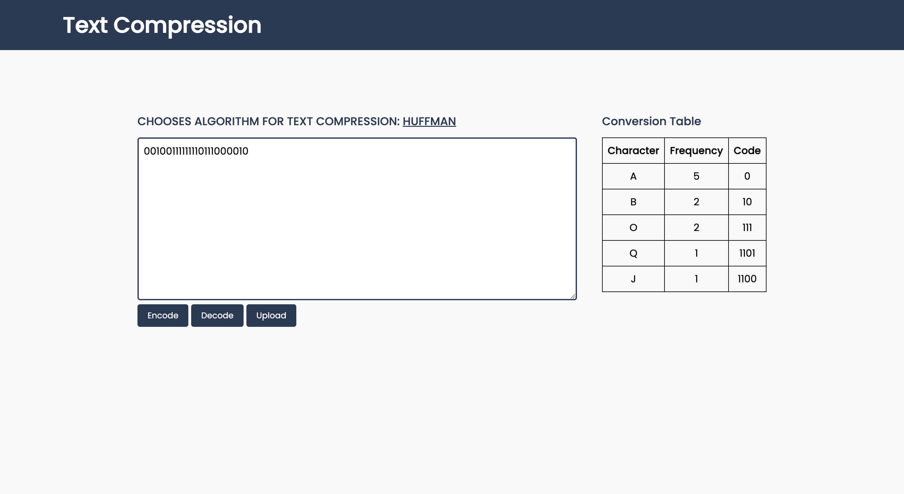

<!-- Banner -->
<p align="center">
  <a href="https://www.uit.edu.vn/" title="Trường Đại học Công nghệ Thông tin" style="border: none;">
    
  </a>
</p>

<h1 align="center"><b>TÍNH TOÁN ĐA PHƯƠNG TIỆN</b></h>

## THÀNH VIÊN NHÓM

| STT |   MSSV   |       Họ và Tên |     Chức Vụ |                                                    Github |                  Email |
| --- | :------: | --------------: | ----------: | --------------------------------------------------------: | ---------------------: |
| 1   | 19521676 |  Đỗ Trọng Khánh | Nhóm trưởng |   [trong-khanh-1109](https://github.com/trong-khanh-1109) | 19521676@gm.uit.edu.vn |
| 2   | 19521383 | Võ Phạm Duy Đức |  Thành viên |             [ducducqn123](https://github.com/ducducqn123) | 19521383@gm.uit.edu.vn |
| 3   | 19521326 | Trịnh Công Danh |  Thành viên | [danhtrinh15092001](https://github.com/danhtrinh15092001) | 19521326@gm.uit.edu.vn |

## GIỚI THIỆU MÔN HỌC

-   **Tên môn học:** Tính toán đa phương tiện
-   **Mã môn học:** CS232
-   **Mã lớp:** CS232.M21.KHCL
-   **Năm học:** HK2 (2021 - 2022)
-   **Giảng viên**: TS.Đỗ Văn Tiến

## ĐỒ ÁN CUỐI KÌ

-   **Tên đề tài**: Nén dữ liệu text sử dụng thuật toán **Huffman** and **Shanon Fano.**
-   **Giới thiệu**
    -   Thuật toán **Huffman** là một thuật toán có tiền tố tối ưu cụ thể thường được sử dụng để nén dữ liệu không mất mát.
    -   Thuật toán **Shannon Fano** là một kỹ thuật mã hóa entropy để nén dữ liệu không mất mát của tính toán đa phương tiện.
-   **Hướng dẫn cài đặt**
    ```bash
      git clone https://github.com/Karhdo/CS232.M21.KHCL.git
      cd CS232.M21.KHCL
      npm install
      npm run build
    ```

    <h3 align="center">
        <a href="https://karhdo.github.io/CS232.M21.KHCL/">DEMO</a>
    </h3>

    
